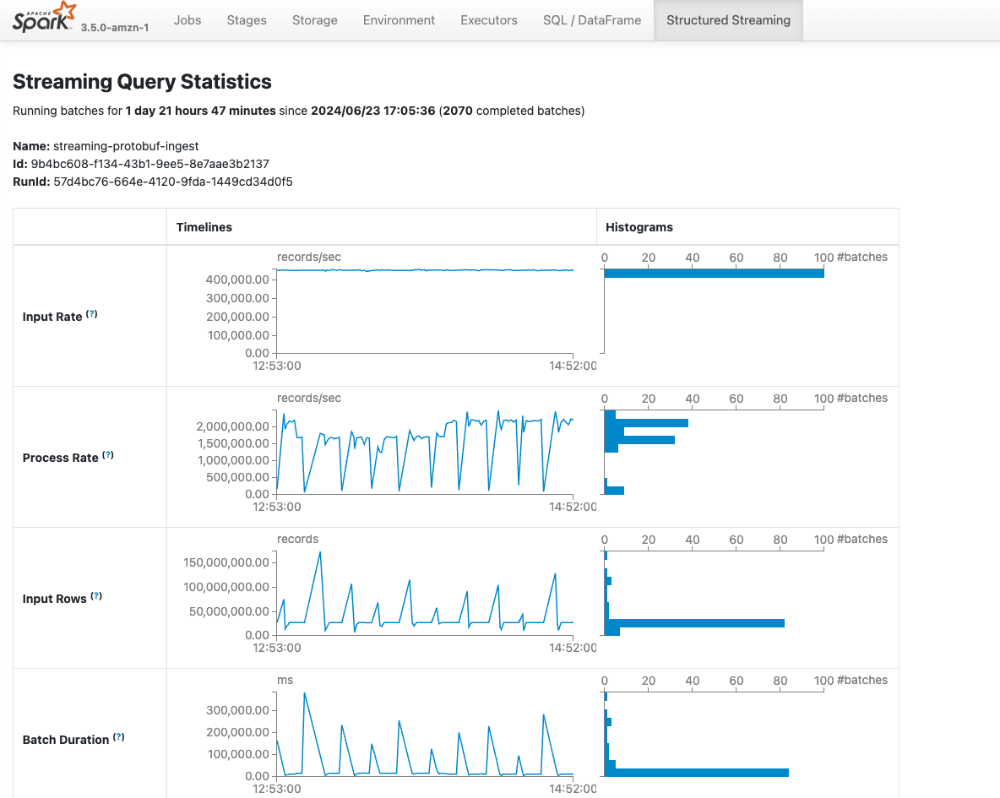
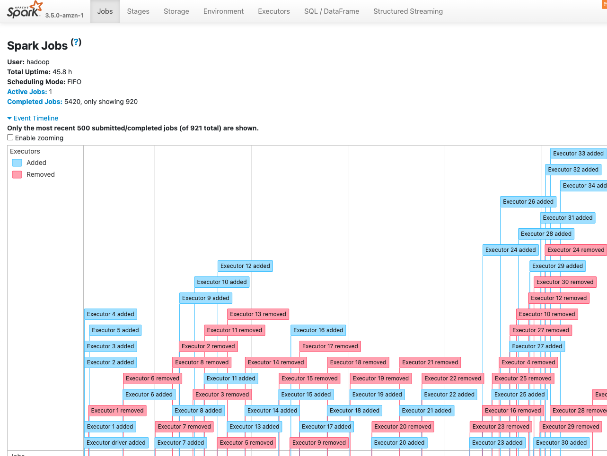

# Streaming Apache Iceberg examples using Apache Spark

This projects has examples of high volume streaming ingestion from [Apache Kafka](https://kafka.apache.org/) using [Apache Spark](https://spark.apache.org/) and [Apache Iceberg](https://iceberg.apache.org/). 

The focus in this repository is to go further than the typical poc consuming few messages or small csv files. The aim here is to provide support for around **400,000 msg/seg** on all scenarios. 

The concepts seen here are applicable to PySpark or Scala programs with little effort. Remember that we just program
the transformations and those are converted to a logical plan and then to native code via the Java Virtual Machine (JVM) or to native code using projects such as [Apache Data Fusion Comet](https://github.com/apache/datafusion-comet), [Velox](https://github.com/apache/datafusion-comet) or [Photon](https://www.databricks.com/product/photon).

Why Java? Because why not, remember that this nowadays gets executed by the JVM ( until previous projects arise). Remember that with this approach we can use libraries in an easy way ( without the Scala/Python/Java 'mess'), we can program performant UDFs and there is a friendly local development environment (where you can debug everything with breakpoints) with different options.

The example uses maven profiles to automatically filter required libraries when deployed to [Amazon EMR](https://aws.amazon.com/emr/) ( the Spark and Iceberg libraries will be marked as provided) and therefore you will be using the optimized Spark runtime from EMR. The logging is implemented using [Log4j2](https://logging.apache.org/log4j/2.12.x/) ( where its config can be further tuned using EMR Serverless configs) as Spark uses it behind the scenes. 

**Environment types:** 

- Local development using a [dockerized Kafka](https://github.com/bitnami/containers/blob/main/bitnami/kafka/).
- Local development against Amazon S3, and AWS Glue Catalog, here we will also use the dockerized Kafka.
- Production mode where we can deploy the code to an Amazon EMR Serverless cluster.

You can run these examples on any Spark compatible runtime too, but that's for a pull request ( if you like to contribute).

In the case of Amazon Web Services on AWS Glue, Amazon EMR or Amazon EMR Serverless.

Remember also that these jobs and code can be adapted for **batch mode** easily (and remember that you can use Kafka as batch source!). A batch job is just a special streaming job with a start and an end anyway.

### A note on performance

Although the code here aims for performance more tuning can be done for achieving specific goals such as improving latency.

Remember that Apache Iceberg have merge-on-read capabilities. In this repo, the default settings for tables are used
but mixing copy-on-write with merge-on-read can lead to some gains as we will write faster.

Remember that this is not a free lunch, you will need to compact if you want good performance.

Another cool thing to test is to use Avro for the ingestion tables and then compact to parquet. 

A good doc to read about these settings and more can be seen on the [Best Practices for Optimizing Apache Iceberg workloads](https://docs.aws.amazon.com/prescriptive-guidance/latest/apache-iceberg-on-aws/best-practices.html) from AWS Documentation.

Another good read can be seen on this blog from Cloudera: [Optimization Strategies for Iceberg Tables](https://blog.cloudera.com/optimization-strategies-for-iceberg-tables/)

## IoT Scenarios

Here we have different approaches and common formats. About the different scenarios the main idea is high throughput streaming
ingestion:
- Native Iceberg writing with deduplication via even-time watermarking.
- Custom process writing with compaction via n-batches and deduplication via merge into( to be implemented).

For the different formats we will have the native use case implemented and the ProtoBuf one will have all the scenarios.

The most advanced example using Protocol Buffers is in ```com.aws.emr.spark.iot``` package.

Later on a job rewriting older partitions to check for duplicates are found and rewrite affected partitions may run. 
An example of such approach can be seen also on the Utils class of ```com.aws.emr.spark.iot``` package.

Remember that exactly once systems are difficult to implement and that for Spark you will need and idempotent sink.

If you want to use the GlueSchemaRegistry you should create in the console a stream registry named ```employee-schema-registry```.

### Protocol Buffers

[Protocol Buffers](https://protobuf.dev/) are language-neutral, platform-neutral extensible mechanisms for serializing structured data.

**Examples**: 
- Native Java Producer/Consumer. 
- AWS Glue Registry based Java Producer/Consumer.
- Native Spark Structured streaming consumer. 
- UDF based Spark Structured streaming consumer.

Create a schema for the Glue registry ```Employee.proto``` if you like to use the Registry based producer/consumer:

```
syntax = "proto3";
package gsr.proto.post;

import "google/protobuf/wrappers.proto";
import "google/protobuf/timestamp.proto";

message Employee {
      int32 id = 1;
      string name = 2;
      string address = 3;
      google.protobuf.Int32Value employee_age = 4;
      google.protobuf.Timestamp start_date = 5;
     Team team = 6;
     Role role = 7;

}
message Team {
     string name = 1;
     string location = 2;
}
enum Role {
     MANAGER = 0;
     DEVELOPER = 1;
     ARCHITECT = 2;
}
```

### Apache Avro

[Apache Avro](https://avro.apache.org/) - a data serialization system.

**Examples**: 
- Native Java Producer/Consumer. 
- AWS Glue Registry based Java Producer/Consumer.
- Native Spark Structured streaming consumer. 

Create a schema for the Glue registry ```Employee.avsc``` if you like to use the Registry based producer/consumer:
```
{"namespace": "gsr.avro.post",
 "type": "record",
 "name": "Employee",
 "fields": [
     {"name": "employee_id", "type": "long"},
     {"name": "age",  "type": "int"},
     {"name": "start_date",   "type": "long"},
   {"name": "team", "type": "string"},
   {"name": "role", "type": "string"},
   {"name": "address", "type": "string"},
   {"name": "name", "type": "string"}]
}
```

### Json

There is plenty of literature over the internet on how integrate Spark with Json data, therefore we just implemented one usecase.

**Examples**:
- AWS Glue Registry based Java Producer/Consumer.


Create a schema for the Glue registry ```Employee.json``` if you like to use the Registry based producer/consumer:
```
{
  "$id": "https://example.com/Employee.schema.json",
  "$schema": "http://json-schema.org/draft-07/schema#",
  "title": "Employee",
  "description": "",
  "type": "object",
  "properties": {
    "employeeId": {
      "description": "The unique identifier for a employee",
      "type": "integer"
    },
    "name": {
      "description": "Name of the employee",
      "type": "string"
    }
  }
}

```
## CDC Scenarios

Here the reference is Tabular [Apache Iceberg Cookbook](https://tabular.io/apache-iceberg-cookbook/) and these blogposts:
 - https://tabular.io/blog/hello-world-of-cdc/
 - https://tabular.io/blog/cdc-data-gremlins/#eventual-consistency-causes-data-gremlins
 - https://tabular.io/blog/cdc-merge-pattern/
 - https://tabular.io/blog/cdc-zen-art-of-cdc-performance/

Here we will focus on the Mirror MERGE patter, as stated in the Iceberg Cookbook the first part could be managed by 
the Kafka Connect Tabular connector, but we will implement both processing pipelines using Spark. 

The relevant classes are withing the ```com.aws.emr.spark.cdc``` package.  

```KafkaCDCSimulator``` class is a Java producer simulating CDC data in [AWS Database Migration Service(DMS)](https://aws.amazon.com/es/dms/) format. 
```SparkLogChange```  class is a Structured Streaming consumer that outputs a CDC changelog to an Iceberg table. 
```SparkCDCMirror``` class is a Spark batch pipeline that process the MERGE using the Mirror approach. 

## Requirements

* Java 17 + ( you could adapt this code easily to run on Java 8 or Java 11)
* Maven 3.9+
* 16GB of RAM and more than 2 cores. 
* Whatever IDE you like ([Intellij](https://www.jetbrains.com/intellij/), [Visual Studio Code](https://code.visualstudio.com/), [NetBeans](https://apache.netbeans.org/), etc)

For local development and testing you can use the provided ```docker-compose.yml``` to spin up a Kafka cluster.

You can generate the description file using the protobuf compiler like this. You need to install the protobuf compiler for your system, for example on MacOs is available on ```brew```. 

```protoc --include_imports --descriptor_set_out=Employee.desc Employee.proto'```

Remember that for simple scenarios you will be better suited using [Kafka Connect Tabular Iceberg Connector](https://github.com/tabular-io/iceberg-kafka-connect/tree/main) or using [Amazon Kinesis Firehose](https://aws.amazon.com/firehose/).

### Running on EMR Serverless:

Create a S3 bucket with the following structure. 

```
s3bucket/
	/jars
	/employee.desc -- or your custom protocol buffers descriptors
	/warehouse
	/checkpoint
```

Package your application using the ```emr``` Maven profile, then upload the jar of the project to the ```jars``` folder. The ```warehouse``` will be the place where the Iceberg Data and Metadata will live and ```checkpoint``` will be used for Structured Streaming checkpointing mechanismn. 
 
Create a Database in the AWS Glue Data Catalog with the name ```bigdata```.

You need to create an EMR Serverless application with ```default settings for batch jobs only```, application type ```Spark``` release version ```7.1.0``` and ```x86_64``` as architecture, enable ```Java 17``` as runtime, enable ```AWS Glue Data Catalog as metastore```
integration and enable ```Cloudwatch logs``` if desired.

Then you can issue a job run using this aws cli command. Remember to change the desired parameters.

```aws emr-serverless start-job-run     --application-id application-identifier     --name job-run-name     --execution-role-arn arn-of-emrserverless-role --mode 'STREAMING'     --job-driver
	'{
        "sparkSubmit": {
            "entryPoint": "s3://s3bucket/jars/streaming-iceberg-ingest-1.0-SNAPSHOT.jar",
            "entryPointArguments": ["true","s3://s3bucket/warehouse","s3://s3bucket/Employee.desc","s3://s3bucket/checkpoint","kafkaBootstrapString","true"],
            "sparkSubmitParameters": "--class com.aws.emr.spark.iot.SparkCustomIcebergIngest --conf spark.executor.cores=4 --conf spark.hadoop.hive.metastore.client.factory.class=com.amazonaws.glue.catalog.metastore.AWSGlueDataCatalogHiveClientFactory --conf spark.executor.memory=16g  --conf spark.driver.cores=2 --conf spark.driver.memory=8g --conf spark.dynamicAllocation.minExecutors=4 --conf spark.jars=/usr/share/aws/iceberg/lib/iceberg-spark3-runtime.jar --conf spark.emr-serverless.executor.disk.type=shuffle_optimized --packages org.apache.spark:spark-sql-kafka-0-10_2.12:3.5.1"
        }
    }'
{	
```

Expected performance should be around 450.000 msgs per sec if you use the ```SparkCustomIcebergIngest```.



You can also see the cluster autoscaling into action:



### Running on a local environment.

1. Install a Java SDK 17 like [Amazon Coretto](https://aws.amazon.com/corretto/).
2. Install [Docker](https://www.docker.com/) for your environment. 
3. Open the desired IDE. 
4. Use the IDE to issue the ```package ``` command of maven selecting the local profile.
5. If you wish to use the AWS Glue Data Catalog and S3 remember to have the corresponding permissions (have your AWS credentials avaliable), there are plugins for both [Intellij](https://aws.amazon.com/intellij/?pg=developertools) and [Visual Studio Code](https://aws.amazon.com/visualstudiocode/) that can be helpful here.
6. Start the local Kafka broker via ```docker-compose up``` command.
7. Run the examples with the desired arguments, remember that you will need to add the required VM options for letting Spark to work on Java 17: 
```
--add-opens=java.base/java.lang=ALL-UNNAMED
--add-opens=java.base/java.lang.invoke=ALL-UNNAMED
--add-opens=java.base/java.lang.reflect=ALL-UNNAMED
--add-opens=java.base/java.io=ALL-UNNAMED
--add-opens=java.base/java.net=ALL-UNNAMED
--add-opens=java.base/java.nio=ALL-UNNAMED
--add-opens=java.base/java.util=ALL-UNNAMED
--add-opens=java.base/java.util.concurrent=ALL-UNNAMED
--add-opens=java.base/java.util.concurrent.atomic=ALL-UNNAMED
--add-opens=java.base/sun.nio.ch=ALL-UNNAMED
--add-opens=java.base/sun.nio.cs=ALL-UNNAMED
--add-opens=java.base/sun.security.action=ALL-UNNAMED
--add-opens=java.base/sun.util.calendar=ALL-UNNAMED
--add-opens=java.security.jgss/sun.security.krb5=ALL-UNNAMED
```

### Running the Kafka producer on AWS

Create a Amazon MSK cluster with at leas two brokers using ```3.5.1```, [Apache Zookeeper](https://zookeeper.apache.org/) mode version and use as instance type ```kafka.m7g.xlarge```. Do not use public access and choose two private subnets to deploy it. For the security group remember that the EMR cluster and the EC2 based producer will need to reach the cluster and act accordingly. For security, use ```PLAINTEXT``` (in production you should secure access to the cluster). Choose ```200GB``` as storage size for each broker and do not enable ```Tiered storage```. For the cluster configuration use this one:

```
auto.create.topics.enable=true
default.replication.factor=3
min.insync.replicas=2
num.io.threads=8
num.network.threads=5
num.partitions=32
num.replica.fetchers=2
replica.lag.time.max.ms=30000
socket.receive.buffer.bytes=102400
socket.request.max.bytes=104857600
socket.send.buffer.bytes=102400
unclean.leader.election.enable=true
zookeeper.session.timeout.ms=18000
compression.type=zstd
log.retention.hours=2
log.retention.bytes=10073741824
```

Running the Kafka producer on an Amazon EC2 instance, remember to change the bootstrap connection string.

You will need to install Java if you are using and Amazon Linux instance. 
```
sudo yum install java-17-amazon-corretto-devel
```
Then, download the jar to the instance and execute the producer. With the following command you can start the Protocol Buffers Producer.
```
aws s3 cp s3://s3bucket/jars/streaming-iceberg-ingest-1.0-SNAPSHOT.jar .
java -cp streaming-iceberg-ingest-1.0-SNAPSHOT.jar com.aws.emr.proto.kafka.producer.ProtoProducer kafkaBoostrapString
```

Remember that your EC2 instance need to have network access to the MSK cluster, you will need to configure the VPC, Security Groups and Subnet/s. 

## Costs

Remember that this example is for high throughput scenarios and therefore the config may lead to quite big bill if deployed on top of AWS, remember to stop the EMR Serverless application, the used instance for the Kafka producer and delete the Amazon MSK cluster when not in use.

## Security

The code here is not secured in any way, you should secure your Apache Kafka cluster and be aware that some dependencies may have known vulnerabilities. If you deploy any service on top of AWS you should configure the roles using the least permission model
using [IAM roles](https://docs.aws.amazon.com/IAM/latest/UserGuide/id_roles.html) and [Amazon Lake Formation](https://aws.amazon.com/lake-formation/) if needed. 

## Contributing

See [CONTRIBUTING](CONTRIBUTING.md) for more information.

## License

This library is licensed under the MIT-0 License. See the LICENSE file.
