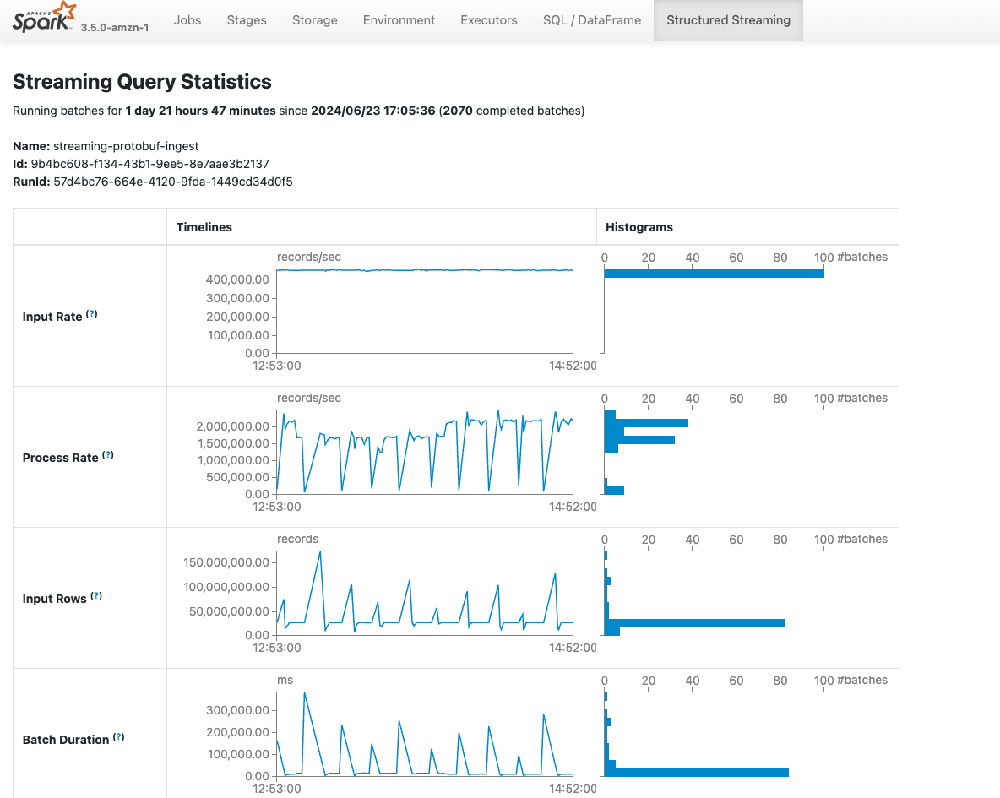
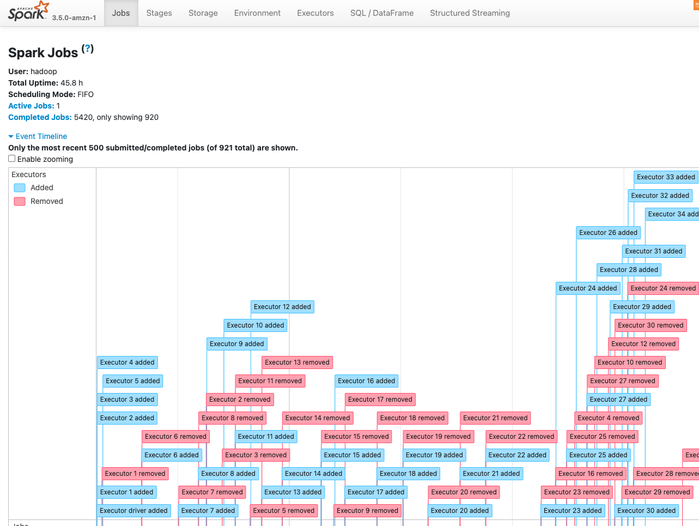

# Streaming Apache Iceberg examples using Apache Spark

Apache Kafka has become the de facto standard for building real-time data pipelines, but ingesting
and storing large amounts of streaming data in a scalable and performant way is a complex,
resource-intensive task. This project shows how an open table format - [Apache
Iceberg](https://iceberg.apache.org/) - combined with [Apache Kafka](https://kafka.apache.org/) and
[Apache Spark](https://spark.apache.org/) Structured Streaming addresses those challenges with
high-throughput streaming ingestion.

The focus here goes further than the typical PoC that consumes a few messages or small CSV files:
the examples aim to sustain around **400,000 msg/sec** in every scenario.

Two example domains are used throughout:

* **IoT: EV vehicle telemetry** - a simple, flat `VehicleTelemetry` reading (vehicle id, event time,
  model, speed, state of charge, odometer, charging flag), produced at high rate in **Protocol
  Buffers, Avro or JSON**, ingested into Iceberg with several write strategies.
* **CDC: bank-account changes** - a DMS-like change feed (insert/update/delete with a monotonic
  source sequence) mirrored into an Iceberg table with a guarded MERGE.

The concepts are applicable to PySpark or Scala programs with little effort - we program the
transformations, which are converted to a logical plan and executed by the JVM (or by native
engines such as [Apache DataFusion Comet](https://github.com/apache/datafusion-comet),
[Velox](https://github.com/facebookincubator/velox) or
[Photon](https://www.databricks.com/product/photon)). Why Java? Easy library reuse, performant
UDFs, and a friendly local development environment where everything can be debugged with
breakpoints. A full **PySpark counterpart** ships in [`python/`](python/).

**Environment types.** Every scenario runs from the same jar and the same class - you only change
the order-independent `key=value` arguments (see [Run configuration and unified
arguments](#run-configuration-and-unified-arguments)):

- Local development using a [dockerized Kafka](docker-compose.yml) (the official `apache/kafka`
  image in KRaft mode) and a Hadoop file catalog under `./warehouse` (`catalog=local`).
- Local development (still `runtime=local`, great for debugging) writing to Amazon S3 through the
  AWS Glue Data Catalog (`catalog=glue`) or to an Amazon S3 Tables managed bucket
  (`catalog=s3tables`), with the dockerized or a remote Kafka.
- Production on Amazon EMR / EMR Serverless (`runtime=emr`) with `catalog=glue` or
  `catalog=s3tables`, on release label `emr-spark-8.0.0` (Spark 4.0.2, Scala 2.13).

Remember that these jobs adapt to **batch mode** easily: pass `trigger=availablenow` and the same
streaming query drains everything available on the topic in bounded micro-batches and stops - a
batch job is just a streaming job with a start and an end (and you can use Kafka as a batch source).

## Run configuration and unified arguments

Every example shares a single, self-documenting configuration helper
(`com.aws.emr.common.JobConfig` in Java, `iceberg_streaming.common.jobconfig` in Python). All jobs
and producers take order-independent `key=value` arguments, so the same class covers what used to be
many near-identical classes - the **table layout**, the **source payload format** and the **write
behaviour** are all knobs:

```
runtime=local|emr             where Spark runs (default: local -> master local[*]; emr -> inferred)
catalog=local|glue|s3tables   Iceberg catalog / storage (default: local)
warehouse=<path|s3 uri|arn>   catalog warehouse (default 'warehouse' for local; an s3://... URI for
                              glue; the table bucket ARN for s3tables)
checkpoint=<path|s3 uri>      structured streaming checkpoint base dir (default: tmp/). Every
                              streaming query derives its own per-query path under it.
bootstrap=<host:port,...>     Kafka bootstrap servers (default: localhost:9092)

--- table layout knobs (one CREATE TABLE recipe for every job) ---
table=<name>                  target table name (job-specific default, e.g. vehicle_telemetry)
mode=cow|mor                  copy-on-write or merge-on-read row-level operations
fv=2|3                        Iceberg format-version (default 3; v3 => deletion vectors)
fileformat=parquet|orc|avro   Iceberg data/delete file format (default parquet)
objectstorage=true|false      Iceberg object-storage layout for S3 (default false)
fanout=true|false             Spark fanout writers (default true)
manifestmerge=true|false      Iceberg manifest merge-on-commit (default true)

--- streaming behaviour knobs ---
source=proto|avro|json        Kafka payload format for the telemetry jobs (default proto)
topic=<name>                  Kafka topic (default: telemetry-<source>; CDC topics are fixed)
dedup=none|batch|merge|watermark   dedup strategy (see "Deduplication strategies")
compaction=none|inline|scheduled   compaction strategy (see "Maintenance")
trigger=<seconds>|availablenow     micro-batch trigger; availablenow = drain the topic and stop
watermark=<duration>          event-time watermark delay for dedup=watermark ('120 seconds')
startingOffsets=latest|earliest|{json}   Kafka start offsets on a fresh checkpoint
maxOffsetsPerTrigger=<n>      cap records per micro-batch (default: unset -> drain all)
failOnDataLoss=true|false     Kafka failOnDataLoss (default: Kafka default true)

--- misc ---
descriptor=<path>             protobuf descriptor (default src/main/protobuf/VehicleTelemetry.desc)
avro=<path>                   Avro .avsc schema (default src/main/avro/VehicleTelemetry.avsc)
shuffle=<n>                   spark.sql.shuffle.partitions initial value; AQE coalesces (200/800)
region=<aws-region>           Glue Schema Registry region (default eu-west-1)
```

The three run scenarios map to arguments as follows:

1. **Local development** (Hadoop file catalog under `./warehouse`, Kafka on `localhost:9092`) - run
   with no arguments, or just toggle behaviour, e.g. `dedup=merge compaction=inline`.
2. **Local Spark on top of Amazon S3 / S3 Tables** - keep `runtime=local` (great for debugging with
   breakpoints) but store the data in the cloud:
   - S3 via the AWS Glue Data Catalog:
     `catalog=glue warehouse=s3://your-bucket/warehouse checkpoint=s3://your-bucket/checkpoint bootstrap=...`
   - Amazon S3 Tables (managed Iceberg):
     `catalog=s3tables warehouse=arn:aws:s3tables:<region>:<account>:bucket/<table-bucket> checkpoint=s3://your-bucket/checkpoint bootstrap=...`
     For local S3 Tables runs you must also put the S3 Tables catalog client on the classpath, for
     example by adding
     `--conf spark.jars.packages=software.amazon.s3tables:s3-tables-catalog-for-iceberg-runtime:0.1.8`
     (it is a `provided` dependency in the build so it is not shaded into the jar).
3. **Amazon EMR on S3 / S3 Tables** - set `runtime=emr` so the master is inferred from the cluster,
   and pick `catalog=glue` or `catalog=s3tables` with the appropriate `warehouse`. On
   `emr-spark-8.0.0` the Iceberg and S3 Tables runtimes are provided by EMR.

You need valid AWS credentials on your machine for the `glue` and `s3tables` catalogs when running
locally (the standard AWS credential chain is used).

### The knob matrix replaces a zoo of classes

What used to be ten-plus nearly identical classes is now the same two ingest jobs with arguments:

```bash
# was SparkCustomIcebergIngestMoR:            merge-on-read parquet + scheduled compaction
... SparkCustomIcebergIngest mode=mor dedup=merge compaction=scheduled
# was SparkCustomIcebergIngestMoRS3BucketsAvro: Avro files + object-storage layout
... SparkCustomIcebergIngest mode=mor fileformat=avro objectstorage=true
# was the ORC variants:
... SparkCustomIcebergIngest mode=mor fileformat=orc objectstorage=true
# was SparkNativeIcebergIngestAvro:           Avro payload, native writer
... SparkNativeIcebergIngest source=avro
# was SparkS3TablesMergeV2/V3:                v2 vs v3 A/B with everything else identical
... SparkCustomIcebergIngest catalog=s3tables fv=2 table=vehicle_telemetry_v2 dedup=merge
... SparkCustomIcebergIngest catalog=s3tables fv=3 table=vehicle_telemetry_v3 dedup=merge
# catch-up / backfill: drain the topic and stop
... SparkCustomIcebergIngest trigger=availablenow startingOffsets=earliest
```

### Quick start: the IoT scenario locally (docker compose, v3 tables)

The complete pipeline - Kafka broker, dev-profile build, telemetry producer and the Spark ingest
job writing an Iceberg **v3** table (`fv=3` is the default) to the local Hadoop catalog under
`./warehouse` - is one command:

```bash
scripts/run-local.sh dedup=merge compaction=inline
```

The script brings the broker up, builds the jar, starts the producer in the background and runs
`SparkCustomIcebergIngest` in the foreground (Spark UI on http://localhost:4040, Ctrl-C stops
everything). Any `key=value` argument is forwarded to both the producer and the job, so the whole
knob matrix works from here (`source=avro`, `mode=mor fileformat=orc`, `fv=2`, ...).

If you prefer to run the pieces yourself:

```bash
# 1. Kafka broker (KRaft, official apache/kafka image) on localhost:9092
docker compose up -d

# 2. Build the local uber-jar (dev profile bundles Spark + Iceberg 1.11)
mvn -Pdev clean package -DskipTests

# 3. Spark 4 on Java 17 needs the JVM module options (spark-submit injects these for you;
#    running with plain `java` you must pass them - same list as the IDE section below)
export SPARK_JVM_FLAGS="-XX:+IgnoreUnrecognizedVMOptions --add-modules=jdk.incubator.vector --add-opens=java.base/java.lang=ALL-UNNAMED --add-opens=java.base/java.lang.invoke=ALL-UNNAMED --add-opens=java.base/java.lang.reflect=ALL-UNNAMED --add-opens=java.base/java.io=ALL-UNNAMED --add-opens=java.base/java.net=ALL-UNNAMED --add-opens=java.base/java.nio=ALL-UNNAMED --add-opens=java.base/java.util=ALL-UNNAMED --add-opens=java.base/java.util.concurrent=ALL-UNNAMED --add-opens=java.base/java.util.concurrent.atomic=ALL-UNNAMED --add-opens=java.base/jdk.internal.ref=ALL-UNNAMED --add-opens=java.base/sun.nio.ch=ALL-UNNAMED --add-opens=java.base/sun.nio.cs=ALL-UNNAMED --add-opens=java.base/sun.security.action=ALL-UNNAMED --add-opens=java.base/sun.util.calendar=ALL-UNNAMED --add-opens=java.security.jgss/sun.security.krb5=ALL-UNNAMED -Djdk.reflect.useDirectMethodHandle=false -Dio.netty.tryReflectionSetAccessible=true"

# 4. Terminal A: produce EV telemetry (protobuf; unthrottled - use rate=/count= to bound it)
java -cp target/streaming-iceberg-ingest-1.0-SNAPSHOT.jar \
  com.aws.emr.kafka.TelemetryProducer format=proto

# 5. Terminal B: ingest into the Iceberg v3 table bigdata.vehicle_telemetry (./warehouse)
java $SPARK_JVM_FLAGS -cp target/streaming-iceberg-ingest-1.0-SNAPSHOT.jar \
  com.aws.emr.spark.iot.SparkCustomIcebergIngest \
  startingOffsets=earliest dedup=merge compaction=inline
```

Watch the `[stream-progress]` lines for per-batch throughput. To verify what landed without any
extra tooling, use the maintenance job's read-only report (snapshot / manifest / data-file counts):

```bash
java $SPARK_JVM_FLAGS -cp target/streaming-iceberg-ingest-1.0-SNAPSHOT.jar \
  com.aws.emr.spark.maintenance.IcebergMaintenance table=vehicle_telemetry dry-run=true
```

The PySpark equivalent (same broker, same v3 defaults):

```bash
cd python && uv sync
uv run telemetry-producer format=proto count=1000000     # terminal A
uv run iot-custom-ingest startingOffsets=earliest dedup=merge   # terminal B
```

### A note on Iceberg v3 tables

Tables are created as **Apache Iceberg format-version 3 (v3)** by default (`fv=3`). Iceberg v3
became production ready with Apache Iceberg 1.11.0 and brings, among other things, deletion vectors
(used automatically by the merge-on-read examples instead of v2 positional delete files), row
lineage, the VARIANT type, default column values, nanosecond timestamps and multi-argument partition
transforms. Pass `fv=2` to any job to A/B the two delete encodings under an identical workload.

**Runtime / version compatibility.** v3 (and deletion vectors) needs Iceberg **1.11.0+**. This repo
pins that locally, but a managed runtime may ship an older Iceberg, so confirm before assuming v3
behaviour:

| Where | Spark | Iceberg | Notes |
|---|---|---|---|
| Local (this repo) | 4.0.2 | 1.11.0 (pinned in `pom.xml` / `pyproject.toml`) | full v3 + deletion vectors |
| EMR `emr-spark-8.0.0` | 4.0.2 | provided by the runtime - verify the label ships >= 1.11 | if it ships 1.10.x, v3 tables may not behave as documented |

Because the EMR profile marks Iceberg `provided`, the cloud runtime - not this build - decides the
effective Iceberg version. Check it on your target release before running the v3 examples there.

## Producing streaming data (three formats, two domains)

The producing side is part of the story: the same telemetry record is produced in three payload
formats so the ingest examples can be compared like for like.

* `com.aws.emr.kafka.TelemetryProducer` (`telemetry-producer` in Python) - the fast EV telemetry
  producer. `format=proto|avro|json` selects the serializer; everything else is identical. It uses a
  tight loop, `SplittableRandom`, reused Avro encoders, zstd and large batches; unthrottled it
  saturates a local broker (`rate=` paces it, `count=` bounds it). It deliberately produces the
  data-quality warts the ingest examples handle: 0.1% **late events** (stamped one hour in the
  past), 0.2% **verbatim duplicates**, and - with `corrupt=true` on JSON - ~0.1% malformed lines for
  the dead-letter example. Records carry **no Kafka key**, so arrivals scatter across partitions out
  of order. `acks=1` favours throughput and disables idempotence on purpose: broker-side retries can
  duplicate and reorder, which is exactly the at-least-once behaviour the dedup strategies absorb
  (production feeds usually want the Kafka defaults: `acks=all` + idempotence).
* `com.aws.emr.kafka.KafkaCDCSimulator` (`cdc-simulator`) - the DMS-like CDC feed:
  `operation,account_id,balance,last_updated,seq` CSV records, `I`/`U`/`D` operations, a monotonic
  `seq` (LSN surrogate) and balances in **minor units (cents), `bigint` end to end** - money never
  touches a float. 80% of changes hit a hot key set (delete churn on the same data files - the
  deletion-vector workload), unkeyed by default (`keyed=true` opts into per-key ordering).
* `com.aws.emr.kafka.TelemetryConsumer` (`telemetry-consumer`) - a debugging consumer that decodes
  and prints any of the three formats.
* `com.aws.emr.gsr.TelemetryRegistryProducer` / `TelemetryRegistryConsumer` /
  `SparkProtoRegistry` - the **AWS Glue Schema Registry** variants (protobuf data format): the
  serializer registers/resolves the schema version in the GSR wire header instead of shipping
  descriptor files. Create a registry named `vehicle-telemetry-registry` and register the
  `VehicleTelemetry.proto` schema (below) to use them. JVM-only (no Python port).

The protobuf schema (also used for the registry):

```proto
syntax = "proto3";
package telemetry.ev;

import "google/protobuf/timestamp.proto";

message VehicleTelemetry {
      int64 vehicle_id = 1;
      google.protobuf.Timestamp event_time = 2;
      string model = 3;
      int32 speed_kmh = 4;
      int32 soc_pct = 5;
      int64 odometer_km = 6;
      bool charging = 7;
}
```

The Avro schema is the same record with `event_time` as epoch-millis `long`
([`src/main/avro/VehicleTelemetry.avsc`](src/main/avro/VehicleTelemetry.avsc)); the JSON payload
mirrors the Avro field layout. Generate the protobuf descriptor file with:

```
protoc --include_imports --descriptor_set_out=VehicleTelemetry.desc VehicleTelemetry.proto
```

(a pre-generated copy ships at `src/main/protobuf/VehicleTelemetry.desc`).

## Pattern and parity matrix

The repository is organised around **streaming + Iceberg patterns**, each implemented in Java and,
where noted, PySpark. Entry points are Java classes under `src/main/java/com/aws/emr/...` and the
matching PySpark console scripts in [`python/pyproject.toml`](python/pyproject.toml) (the
`test_entrypoints_parity` test fails CI if a script is renamed or left undocumented).

| Pattern | Java | PySpark | Equivalent? | Notes |
|---|---|---|---|---|
| Native writer ingest (`toTable`) | `SparkNativeIcebergIngest` | `iot-native-ingest` | Yes | `source=proto\|avro\|json`; optional `dedup=watermark` |
| Custom `foreachBatch` ingest | `SparkCustomIcebergIngest` | `iot-custom-ingest` | Yes | `dedup=none\|batch\|merge`, `compaction=none\|inline\|scheduled`, JSON dead-letter |
| UDF decoding | `SparkProtoUDF` | `proto-udf` | Yes | custom decode logic instead of `from_protobuf` |
| SPJ latest-state upsert | `SparkIcebergIngestSpj` | - | Java-only | storage-partitioned join via a bucket-aligned staging table |
| SPJ two-query benchmark (S3 Tables) | `SparkS3TablesTwoQuerySpj` | - | Benchmark-only | `fv=2\|3` A/B, seeded staging stream |
| Ad-hoc table utils | `SparkIcebergUtils` | `iceberg-utils` | Yes | closed-window compaction + duplicate partition rewrite |
| CDC changelog writer | `SparkLogChange` | `cdc-log-change` | Yes | `dedup=batch` drops repeated `seq` per micro-batch |
| CDC mirror (batch MERGE) | `SparkCDCMirror` | `cdc-mirror` | Yes | deterministic + guarded MERGE |
| CDC incremental (snapshot range) | `SparkIncrementalPipeline` | `cdc-incremental` | Partial | Python watermark is a separate commit, not atomic |
| CDC streaming mirror (continuous) | `SparkStreamingCDCMirror` | `cdc-streaming-mirror` | Yes | `table=`/`fv=` for the v2/v3 A/B |
| CDC read benchmark | `SparkCDCReadBenchmark` | - | Benchmark-only | frozen-snapshot v2 vs v3 read cost |
| Table maintenance | `IcebergMaintenance` | `iceberg-maintenance` | Yes | recommended standalone baseline |
| Telemetry producer/consumer | `TelemetryProducer`, `TelemetryConsumer` | `telemetry-producer`, `telemetry-consumer` | Yes | `format=proto\|avro\|json` |
| CDC simulator | `KafkaCDCSimulator` | `cdc-simulator` | Yes | unkeyed by default, `I/U/D`, `seq`-stamped |
| Glue Schema Registry | `TelemetryRegistry*`, `SparkProtoRegistry` | - | Intentional | JVM-only GSR serde |

## IoT scenario: EV vehicle telemetry

High-throughput append ingestion of the telemetry stream into the `vehicle_telemetry` table,
partitioned by `hours(event_time), bucket(16, vehicle_id)`. Every job carries two Kafka lineage
columns (`kafka_partition`, `kafka_offset`) into the table: free to obtain, invaluable when
debugging ("which offset produced this row?"), and the deterministic tiebreaker for dedup.

### Deduplication strategies

Exactly-once systems are difficult; with Spark you need an idempotent sink. The producer deliberately
re-sends 0.2% of records, so the strategies can be compared directly. The **event identity** is
`(vehicle_id, event_time)`: a device re-sending a reading repeats both.

* `dedup=none` - append everything, duplicates included (the baseline).
* `dedup=batch` - `dropDuplicates` on the event identity inside each micro-batch: one cheap shuffle,
  no target scan. Catches the common case (a re-send lands in the same batch); duplicates that split
  across batches survive.
* `dedup=merge` - batch dedup *plus* a `MERGE INTO` whose ON clause is scoped to the recent target
  partitions, so re-deliveries arriving in a *later* batch are suppressed too. This is **bounded
  replay suppression**, not a global upsert (for keyed upserts see the CDC mirror). The in-batch
  dedup partitions by `(vehicle_id, event_time)` - partitioning by `vehicle_id` alone would collapse
  distinct readings of the same vehicle and silently lose data - and ties break deterministically on
  the highest Kafka offset. The shared statement lives in `TelemetrySql` (Java) /
  `iceberg_streaming.iot._sql` (Python) and is unit-tested in CI.
* `dedup=watermark` (native writer only) - stateful `dropDuplicatesWithinWatermark` on the event
  identity. State is bounded by the watermark delay (`watermark=`, default 120s), but events **older
  than the watermark are dropped entirely, not deduplicated**: with the default delay the producer's
  one-hour-late readings are silently discarded on this path. Widen `watermark=` past your
  late-arrival window (more state) or prefer `dedup=merge`, which keeps late data.

A later cleanup for replays that beat the MERGE window ships in `SparkIcebergUtils`: a partition
level `INSERT OVERWRITE ... GROUP BY vehicle_id, event_time` (dynamic partition overwrite) rewrites
just the affected day.

### JSON dead-letter table

With `source=json`, the custom ingest never drops an unparseable record: each micro-batch splits the
failures into `<table>_dead_letter` (the raw line, the Kafka partition/offset, and the rejection
time) and ingests the rest. Feed it with `telemetry-producer format=json corrupt=true`. This is the
pattern to copy for any lossy text format at a system boundary.

### Restrict the affected partitions in the `ON` clause

The most important knob for MERGE performance is limiting how much of the *target* table Spark has to
scan and rewrite. A join predicate on the join key alone forces Spark to consider the whole target.
The telemetry MERGE therefore adds `t.event_time > current_timestamp() - INTERVAL 2 HOURS` to the ON
clause: because the table is partitioned hourly, Iceberg prunes the target to the last couple of
hourly partitions instead of the entire table. Adapt the interval to your own late-arrival window.
If you partition by bucket, restrict by bucket the same way (the CDC mirror is bucketed by
`account_id`, so its `ON a.account_id = c.account_id` prunes to the buckets present in the batch).

### Tune commit retries

Streaming writes, periodic compaction and late-arriving MERGEs all commit against the same table with
optimistic concurrency, so commit conflicts are expected under load. The shared table recipe
(`JobConfig.createTableDdl`) therefore configures generous retries on every table:

```
'commit.retry.num-retries'='20',   -- number of times to retry a commit before failing
'commit.retry.min-wait-ms'='250',  -- minimum back-off before retrying a commit
'commit.retry.max-wait-ms'='60000' -- (1 min) maximum back-off before retrying a commit
```

## CDC scenario

The reference here is the Tabular [Apache Iceberg Cookbook](https://tabular.io/apache-iceberg-cookbook/)
and these blog posts:

 - https://tabular.io/blog/hello-world-of-cdc/
 - https://tabular.io/blog/cdc-data-gremlins/#eventual-consistency-causes-data-gremlins
 - https://tabular.io/blog/cdc-merge-pattern/
 - https://tabular.io/blog/cdc-zen-art-of-cdc-performance/

We focus on the Mirror MERGE pattern; both processing pipelines are implemented with Spark. The
relevant classes are in the `com.aws.emr.spark.cdc` package:

 * `com.aws.emr.kafka.KafkaCDCSimulator` - the producer simulating CDC data in
   [AWS DMS](https://aws.amazon.com/dms/)-like format.
 * `SparkLogChange` - a Structured Streaming consumer writing the CDC changelog to an Iceberg table
   (optional `dedup=batch` drops duplicate deliveries by their unique `seq` inside each micro-batch).
 * `SparkCDCMirror` - a Spark batch pipeline that processes the MERGE using the Mirror approach.
 * `SparkIncrementalPipeline` - incremental (snapshot-range) consumption of the changelog into the
   mirror, with the watermark committed atomically with the MERGE.
 * `SparkStreamingCDCMirror` - the continuous variant, MERGEing every micro-batch straight from
   Kafka; `table=`/`fv=` let you run v2 and v3 side by side on an identical feed.

### Notes on the MERGE pattern

The mirror approach is a `MERGE INTO`. We first deduplicate the changelog keeping the latest change
per key with a windowed `row_number()`, then merge that single row per key into the target table.
The three `WHEN` branches map the CDC operation to a row-level action: a `D` on a matched key becomes
a `DELETE`, any other matched key is an `UPDATE`, and a new key that is not a delete is an `INSERT`.
On the v3 `merge-on-read` target the deletes are written as deletion vectors, so the merge stays
cheap on the write path. The SQL is generated in one place - `com.aws.emr.spark.cdc.CdcSql` (Java)
and `iceberg_streaming.cdc._sql` (Python) - and shared by the batch, snapshot-incremental and
continuous jobs so they cannot drift:

```sql
WITH windowed_changes AS (
    SELECT account_id, balance, last_updated, operation, seq,
           row_number() OVER (PARTITION BY account_id ORDER BY seq DESC) AS row_num
    FROM accounts_changelog WHERE last_updated > current_timestamp() - INTERVAL 1 DAY
),
accounts_changes AS (SELECT * FROM windowed_changes WHERE row_num = 1)
MERGE INTO accounts_mirror a USING accounts_changes c
ON a.account_id = c.account_id
WHEN MATCHED AND c.operation = 'D' AND c.seq >= a.seq THEN DELETE
WHEN MATCHED AND c.seq >= a.seq THEN UPDATE SET a.balance = c.balance, a.last_updated = c.last_updated, a.seq = c.seq
WHEN NOT MATCHED AND c.operation != 'D' THEN
    INSERT (account_id, balance, last_updated, seq) VALUES (c.account_id, c.balance, c.last_updated, c.seq)
```

#### CDC correctness: deterministic ordering and stale-change guards

A CDC feed can deliver changes for the same key out of order - different Kafka partitions, producer
retries, or a later micro-batch that happens to carry an older event. Two rules keep the mirror
correct regardless of arrival order, and both are enforced by the shared SQL above:

1. **Deterministic dedup by source sequence.** The producer stamps every record with a monotonic
   `seq` (a stand-in for a database log sequence number / LSN). The dedup window orders by
   `seq DESC`, *not* by `last_updated` - two changes with the same millisecond timestamp would
   otherwise pick UPDATE vs DELETE arbitrarily. `seq` flows all the way through: the changelog table
   stores it, and the mirror table stores the last applied `seq` per row.
2. **Stale-change guards.** The matched UPDATE and DELETE branches only fire when `c.seq >= a.seq`,
   so an older event arriving in a later batch can never overwrite or delete newer state.

**Known residual limitation (documented, not hidden).** This mirror uses **physical deletes** - the
row is removed - which is deliberate: deleting matched rows on a merge-on-read target is exactly what
exercises v2 positional delete files vs v3 deletion vectors in the benchmark. The trade-off is the
classic CDC "resurrection" case: if a truly stale insert/update for a key arrives *after* that key
was legitimately deleted, the `WHEN NOT MATCHED` branch re-inserts it, because a physically deleted
row leaves no `seq` to compare against. Removing that resurrection requires keeping **tombstones**.
The four standard options are:

1. Preserve source ordering via an LSN/sequence and keep tombstones (soft-delete rows) until a later
   maintenance pass removes them.
2. Require all events for a key on the same Kafka partition and document the ordering assumption
   (the simulator's `keyed=true` mode).
3. Maintain a separate latest-sequence / tombstone table and consult it in the `NOT MATCHED` branch.
4. Use soft deletes in the mirror and physically remove rows in a scheduled job.

This showcase keeps physical deletes (option 4 without the scheduled purge) on purpose so the v2/v3
delete-encoding comparison stays meaningful; adapt to your own durability needs. The
`resurrection-demo` scenario in the Python harness reproduces and asserts exactly this behaviour.

## Maintenance

### Compaction from inside the job (`compaction=inline|scheduled`)

`SparkCustomIcebergIngest` demonstrates both in-job strategies. Both compact **only the recently
closed hourly partitions** - everything newer than three hours ago but strictly before the top of
the current hour - because compacting the hot partition being written maximises optimistic-commit
conflicts with the streaming writer:

```sql
CALL system.rewrite_data_files(
  table => 'vehicle_telemetry',
  strategy => 'sort',
  sort_order => 'event_time',
  where => 'event_time >= current_timestamp() - INTERVAL 3 HOURS
            AND event_time < date_trunc(''hour'', current_timestamp())',
  options => map(
    'rewrite-job-order','bytes-asc',
    'target-file-size-bytes','536870912',
    'max-file-group-size-bytes','10737418240',
    'partial-progress.enabled', 'true',
    'partial-progress.max-commits', '10',
    'max-concurrent-file-group-rewrites', '1000'
  ))
```

`partial-progress.enabled` makes the rewrite commit in several smaller batches, so a conflict only
loses the current group - which is also why the commit retries above matter. `inline` runs every 10
batches inside `foreachBatch` (manifests every 30); `scheduled` runs hourly at five past the hour on
a background thread. In both variants a failed maintenance call is caught and logged - it never
kills the ingest query, and the schedule survives to try again.

### Rewrite manifests from time to time

Every commit adds new manifest files, and a fast streaming trigger with delete-heavy MERGEs produces
a lot of small ones. As the manifest list grows, query planning slows down and each commit has more
metadata to reconcile. `rewrite_manifests` rebuilds the current manifests into a few well-sized ones;
it is metadata-only (no data files rewritten) but still commits against the table, so it runs *less*
often than data compaction (every 30 batches vs every 10). `commit.manifest-merge.enabled` and an
explicit `rewrite_manifests` are complementary: the former merges manifests inline on each commit
(paid on the write path), the latter rebalances them in bulk on a cadence -
`manifestmerge=false` lets you isolate that cost in the v2/v3 comparisons.

### Expire old metadata files automatically

Every commit writes a new table `metadata.json`, and with a fast streaming trigger these pile up
quickly. The shared table recipe keeps the log bounded on every table:

```
'write.metadata.delete-after-commit.enabled' = 'true',
'write.metadata.previous-versions-max' = '100'
```

Snapshot and orphan-file expiration are a separate concern, handled by the maintenance job below.

### Run maintenance from a dedicated job (recommended)

Compacting inside the ingest job is useful to *demonstrate*, but it competes with the writer for
commits and lengthens batches. The recommended baseline is a **separate scheduled maintenance job**,
provided as `IcebergMaintenance` (Java) / `iceberg-maintenance` (PySpark). It bundles the four
standard actions behind one entry point - `rewrite_data_files` (with partial progress),
`rewrite_manifests`, `expire_snapshots` and `remove_orphan_files` - plus a read-only `dry-run=true`
report mode that prints snapshot / manifest / data-file counts without mutating anything:

```bash
# report only (no mutation)
uv run iceberg-maintenance table=accounts_mirror action=all dry-run=true
# compact just the recent partitions, then rebalance manifests
uv run iceberg-maintenance table=vehicle_telemetry action=rewrite_data_files \
    where="event_time >= current_timestamp() - INTERVAL 2 DAYS"
# expire snapshots older than 7 days, keeping at least 100
uv run iceberg-maintenance table=accounts_mirror action=expire_snapshots older-than-days=7 retain-last=100
```

`remove_orphan_files` deletes files no snapshot references, so keep `older-than-days` comfortably
larger than your longest in-flight write/compaction when running it against a live table.

## Observability, testing and reproducibility

### Streaming progress metrics

Rather than eyeballing the Spark UI, the streaming jobs attach a `StreamingQueryListener` - *before*
the query starts, so batch 0 is captured - that logs a concise, grep-friendly line after every
micro-batch: batch id, input rows, input/processed rows-per-second and the trigger/addBatch
durations, prefixed with `[stream-progress]` and formatted as `key=value` so it parses into
CSV/JSON. It is `com.aws.emr.common.StreamingProgressListener` in Java and
`iceberg_streaming.common.observability.attach_progress_listener(spark)` in Python. This is what
makes an A/B run (for example Iceberg v2 vs v3) objectively comparable. To compare v2 and v3 read
latency on a frozen snapshot, `SparkCDCReadBenchmark` writes a stable result rather than relying on
log scraping.

### Reproducibility knobs

The pieces you need for a deterministic replay are wired into `JobConfig`:

- **Unique checkpoints.** Every streaming job derives a per-query checkpoint with
  `checkpointFor(name)` / `checkpoint_for(name)`, so launching several examples with the same
  `checkpoint=` base never collides on incompatible state.
- **Explicit offsets.** `startingOffsets=earliest` replays a pre-loaded topic from the beginning;
  `maxOffsetsPerTrigger=<n>` bounds each micro-batch; `failOnDataLoss=false` survives an aged-out
  offset on a short-retention demo topic.
- **Bounded input.** `telemetry-producer count=<n>` and `cdc-simulator count=<n> accounts=<n>`
  produce bounded, reproducible datasets; `trigger=availablenow` drains them and stops.

### Deterministic scenario harness

A self-checking end-to-end harness ships in the PySpark project
([`python/src/iceberg_streaming/scenarios/`](python/src/iceberg_streaming/scenarios/), console script
`scenario`). It seeds a fixed, `seed`-controlled CDC dataset, runs it through the **same shared
guarded MERGE** the jobs use, in bounded micro-batches, then asserts the final Iceberg table state
against a pure-Python oracle and reports metadata (snapshots, data files, delete files). It runs
locally (no AWS) from either an in-memory source (default, no broker) or a real Kafka topic consumed
with `Trigger.AvailableNow`:

```bash
cd python
uv run scenario cdc-out-of-order            # shuffled, multi-batch: stale updates must not overwrite newer rows
uv run scenario all                         # every scenario; non-zero exit if any final state is wrong
uv run scenario cdc-ordered source=kafka bootstrap=localhost:9092
```

Implemented scenarios: `append-only`, `cdc-ordered`, `cdc-out-of-order` (the regression test for the
`seq` guards), `resurrection-demo` (reproduces and asserts the documented physical-delete
limitation), and `mor-v2` / `mor-v3` (identical final state, different delete encoding).

### Tests and CI

- **Java:** `mvn test` runs JUnit tests for `JobConfig` (argument parsing, knob validation, the
  shared TBLPROPERTIES recipe, trigger parsing) and for the SQL invariants: `CdcSqlTest` asserts the
  `seq` ordering and the `c.seq >= a.seq` guards; `TelemetrySqlTest` asserts the dedup identity
  `(vehicle_id, event_time)`, the Kafka-offset tiebreak and that compaction never touches the hot
  partition.
- **PySpark:** `cd python && uv run pytest` runs the same config/SQL invariants, the scenario-oracle
  model tests, plus an entry-point/README parity test that fails if a console script is renamed or
  left undocumented.
- **CI:** [`.github/workflows/ci.yml`](.github/workflows/ci.yml) runs both on every push and PR, and
  a third job runs the **scenario harness** (`uv run scenario all`, memory source) end to end
  against a real local Spark+Iceberg runtime - the self-checking exit code makes it a true
  integration smoke test.

## Requirements

* Java 17 or 21 (Apache Spark 4.0 dropped support for Java 8 and Java 11; Java 17 is the default and recommended runtime)
* Maven 3.9+
* 16GB of RAM and more than 2 cores.
* Whatever IDE you like ([IntelliJ](https://www.jetbrains.com/idea/), [Visual Studio Code](https://code.visualstudio.com/), [NetBeans](https://netbeans.apache.org/), etc)

For local development and testing you can use the provided `docker-compose.yml` to spin up a Kafka
broker.

Remember that for simple scenarios you may be better served by the
[Iceberg Kafka Connect connector](https://github.com/databricks/iceberg-kafka-connect) or
[Amazon Data Firehose](https://aws.amazon.com/firehose/).

### Running on a local environment

1. Install a Java SDK 17 like [Amazon Corretto](https://aws.amazon.com/corretto/).
2. Install [Docker](https://www.docker.com/) for your environment.
3. Start the local Kafka broker via `docker compose up`.
4. Build with the `dev` profile: `mvn -Pdev clean package` (bundles Spark/Iceberg into the jar).
5. If you wish to use the AWS Glue Data Catalog, S3 or S3 Tables remember to have valid AWS
   credentials available.
6. Run the examples with the desired arguments - or use the one-command demo pipeline:

```bash
scripts/run-local.sh                                        # protobuf -> CoW parquet v3
scripts/run-local.sh source=avro mode=mor fileformat=orc dedup=merge
scripts/run-local.sh source=json corrupt=true               # exercises the dead-letter table
scripts/run-local.sh dedup=merge compaction=inline fv=2
```

Apache Spark 4.0 runs on Java 17 (or 21) and, because of the Java Module System, it needs a set of
`--add-opens`/`--add-modules` start options to avoid `InaccessibleObjectException` errors when
launched directly from an IDE (spark-submit injects them for you; `scripts/run-local.sh` does too).
Add the following VM options to your IDE run configuration:

```
-XX:+IgnoreUnrecognizedVMOptions
--add-modules=jdk.incubator.vector
--add-opens=java.base/java.lang=ALL-UNNAMED
--add-opens=java.base/java.lang.invoke=ALL-UNNAMED
--add-opens=java.base/java.lang.reflect=ALL-UNNAMED
--add-opens=java.base/java.io=ALL-UNNAMED
--add-opens=java.base/java.net=ALL-UNNAMED
--add-opens=java.base/java.nio=ALL-UNNAMED
--add-opens=java.base/java.util=ALL-UNNAMED
--add-opens=java.base/java.util.concurrent=ALL-UNNAMED
--add-opens=java.base/java.util.concurrent.atomic=ALL-UNNAMED
--add-opens=java.base/jdk.internal.ref=ALL-UNNAMED
--add-opens=java.base/sun.nio.ch=ALL-UNNAMED
--add-opens=java.base/sun.nio.cs=ALL-UNNAMED
--add-opens=java.base/sun.security.action=ALL-UNNAMED
--add-opens=java.base/sun.util.calendar=ALL-UNNAMED
--add-opens=java.security.jgss/sun.security.krb5=ALL-UNNAMED
-Djdk.reflect.useDirectMethodHandle=false
-Dio.netty.tryReflectionSetAccessible=true
```

## PySpark alternative (`python/`)

A **PySpark** counterpart of these examples lives in the [`python/`](python/) folder, managed with
[`uv`](https://docs.astral.sh/uv/). The jobs use the **same unified `key=value` arguments**, the same
three run scenarios and the same knob matrix. Quick start:

```bash
cd python
uv sync                       # Python 3.12 + PySpark 4.0.2 + deps
uv run iot-custom-ingest dedup=merge      # pure local dev (hadoop catalog, kafka on localhost:9092)
uv run telemetry-producer format=proto    # feed it
# local Spark on S3 via Glue:
uv run iot-custom-ingest catalog=glue warehouse=s3://your-bucket/warehouse bootstrap=broker:9092
```

See [`python/README.md`](python/README.md) for the full entry-point table, setup,
protobuf-binding generation and troubleshooting. Differences from the Java project: the AWS Glue
Schema Registry clients and the SPJ/benchmark jobs are not ported (JVM-only), and `cdc-incremental`
advances its watermark in a separate commit.

## Running on EMR Serverless

Create an S3 bucket with the following structure:

```
s3bucket/
	/jars
	/VehicleTelemetry.desc -- or your custom protocol buffers descriptors
	/warehouse
	/checkpoint
```

Package the application using the `emr` Maven profile, then upload the jar of the project to the
`jars` folder. The `warehouse` will be the place where the Iceberg data and metadata live and
`checkpoint` will be used for the Structured Streaming checkpointing mechanism.

Create a database in the AWS Glue Data Catalog with the name `bigdata`.

You need to create an EMR Serverless application with `default settings for batch jobs only`,
application type `Spark`, release version `emr-spark-8.0.0` (this release ships Apache Spark 4.0.2
and Scala 2.13; note the release label is `emr-spark-8.0.0`, not `emr-8.0.0`) and `x86_64` as
architecture; enable `Java 17` as runtime, enable `AWS Glue Data Catalog as metastore` integration
and enable `CloudWatch logs` if desired.

Then you can issue a job run using this AWS CLI command (adapt the parameters):

```
aws emr-serverless start-job-run --application-id application-identifier --name job-run-name \
  --execution-role-arn arn-of-emrserverless-role --mode 'STREAMING' --job-driver \
	'{
        "sparkSubmit": {
            "entryPoint": "s3://s3bucket/jars/streaming-iceberg-ingest-1.0-SNAPSHOT.jar",
            "entryPointArguments": ["runtime=emr","catalog=glue","warehouse=s3a://s3bucket/warehouse","descriptor=/home/hadoop/VehicleTelemetry.desc","checkpoint=s3a://s3bucket/checkpoint","bootstrap=kafkaBootstrapString","dedup=merge","compaction=inline"],
            "sparkSubmitParameters": "--class com.aws.emr.spark.iot.SparkCustomIcebergIngest --conf spark.executor.cores=4 --conf spark.hadoop.hive.metastore.client.factory.class=com.amazonaws.glue.catalog.metastore.AWSGlueDataCatalogHiveClientFactory --conf spark.executor.memory=16g --conf spark.driver.cores=2 --conf spark.driver.memory=8g --files s3a://s3bucket/VehicleTelemetry.desc --conf spark.dynamicAllocation.minExecutors=4 --conf spark.emr-serverless.executor.disk.type=shuffle_optimized --packages org.apache.spark:spark-sql-kafka-0-10_2.13:4.0.2"
        }
    }'
```

Expected performance should be around 450,000 msg/sec if you use `SparkCustomIcebergIngest`.



You can also see the cluster autoscaling in action:



## Running the Kafka producer on AWS

Create an Amazon MSK cluster with at least two brokers using a recent Apache Kafka version in
[KRaft](https://kafka.apache.org/documentation/#kraft) mode (Apache Kafka 4.x removed ZooKeeper
entirely, so KRaft is the only supported mode) and use instance type `kafka.m7g.xlarge`. Do not use
public access and choose two private subnets to deploy it. For the security group remember that the
EMR cluster and the EC2-based producer will need to reach the cluster. For security, use `PLAINTEXT`
(in production you should secure access to the cluster). Choose `200GB` as storage size per broker
and do not enable `Tiered storage`. For the cluster configuration use this one:

```
auto.create.topics.enable=true
default.replication.factor=3
min.insync.replicas=2
num.io.threads=8
num.network.threads=5
num.partitions=32
num.replica.fetchers=2
replica.lag.time.max.ms=30000
socket.receive.buffer.bytes=102400
socket.request.max.bytes=104857600
socket.send.buffer.bytes=102400
unclean.leader.election.enable=true
compression.type=zstd
log.retention.hours=2
log.retention.bytes=10073741824
```

Run the producer on an Amazon EC2 instance (install Java 17 first on Amazon Linux):

```
sudo yum install java-17-amazon-corretto-devel
aws s3 cp s3://s3bucket/jars/streaming-iceberg-ingest-1.0-SNAPSHOT.jar .
java -cp streaming-iceberg-ingest-1.0-SNAPSHOT.jar com.aws.emr.kafka.TelemetryProducer bootstrap=kafkaBootstrapString
```

Remember that your EC2 instance needs network access to the MSK cluster (VPC, security groups and
subnets).

## Costs

Remember that this example is for high-throughput scenarios and the config may lead to a quite big
bill if deployed on AWS: stop the EMR Serverless application, the producer instance, and delete the
Amazon MSK cluster when not in use.

## Security

The code here is not secured in any way; you should secure your Apache Kafka cluster and be aware
that some dependencies may have known vulnerabilities. If you deploy any service on AWS configure
the roles using the least-permission model with
[IAM roles](https://docs.aws.amazon.com/IAM/latest/UserGuide/id_roles.html) and
[AWS Lake Formation](https://aws.amazon.com/lake-formation/) if needed.

## Contributing

See [CONTRIBUTING](CONTRIBUTING.md) for more information.

## License

This library is licensed under the MIT-0 License. See the LICENSE file.
